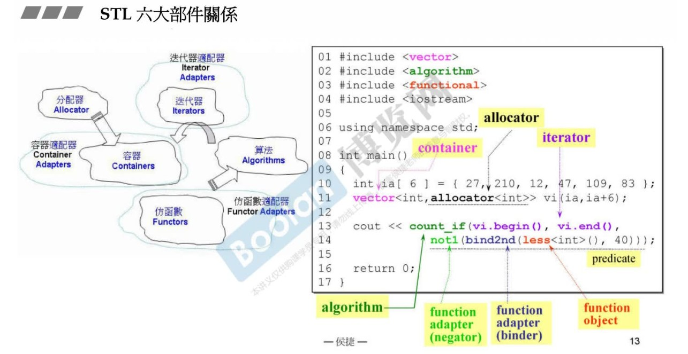
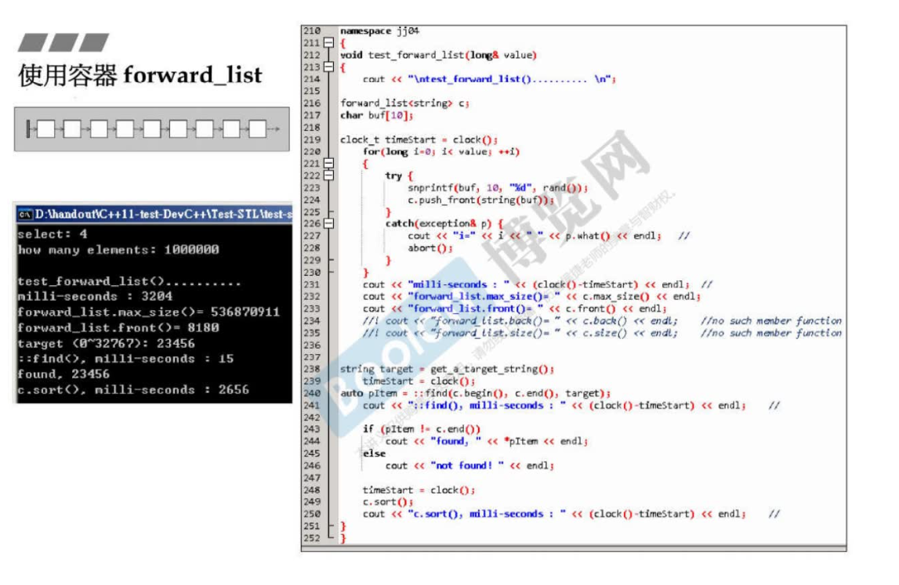
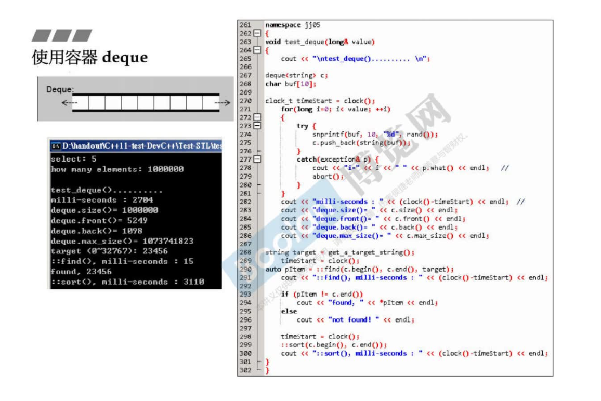

# 第一讲

## STL体系介绍

#### 六大部件




#### 复杂度


#### beging() end() 返回前开后闭

#### auto


### 容器分类

#### 容器

- 序列容器

  - Array
  - Vector
  - Deque
  - List

  - Forward-List

- 关联容器

  - Set/Multiset
  - Map/Multimap

- 无序容器

  - Unordered Set/
  - Unordered Map/


#### 辅助测试

辅助：

```cpp
string get_a_target_string()
{
long target=0;
char buf[10];

	cout << "target (0~" << RAND_MAX << "): ";
	cin >> target;
	snprintf(buf, 10, "%d", target);
	return string(buf);
}

int compareLongs(const void* a, const void* b)
{
  return ( *(long*)a - *(long*)b );
}

int compareStrings(const void* a, const void* b)
{
  if ( *(string*)a > *(string*)b )
     	return 1;
  else if ( *(string*)a < *(string*)b )
     	return -1;  
  else      	
        return 0;  
}
```


##### test_array:


```cpp
#include <array>
#include <iostream>
#include <ctime> 
#include <cstdlib> //qsort, bsearch, NULL

namespace jj01
{
void test_array()
{
	cout << "\ntest_array().......... \n";
     
array<long,ASIZE> c;  	
			
clock_t timeStart = clock();									
    for(long i=0; i< ASIZE; ++i) {
        c[i] = rand(); 
    }
	cout << "milli-seconds : " << (clock()-timeStart) << endl;	//
	cout << "array.size()= " << c.size() << endl;		
	cout << "array.front()= " << c.front() << endl;	
	cout << "array.back()= " << c.back() << endl;	
	cout << "array.data()= " << c.data() << endl;	
	
long target = get_a_target_long();

	timeStart = clock();
    ::qsort(c.data(), ASIZE, sizeof(long), compareLongs);
long* pItem = (long*)::bsearch(&target, (c.data()), ASIZE, sizeof(long), compareLongs); 
	cout << "qsort()+bsearch(), milli-seconds : " << (clock()-timeStart) << endl;	//    
  	if (pItem != NULL)
    	cout << "found, " << *pItem << endl;
  	else
    	cout << "not found! " << endl;	
}
}
```

##### test_vector


```cpp
void test_vector(long& value)
{
	cout << "\ntest_vector().......... \n";
     
vector<string> c;  	
char buf[10];
			
clock_t timeStart = clock();								
    for(long i=0; i< value; ++i)
    {
    	try {
    		snprintf(buf, 10, "%d", rand());
        	c.push_back(string(buf));     		
		}
		catch(exception& p) {
			cout << "i=" << i << " " << p.what() << endl;	
			     //曾經最高 i=58389486 then std::bad_alloc
			abort();
		}
	}
	cout << "milli-seconds : " << (clock()-timeStart) << endl;	
	cout << "vector.max_size()= " << c.max_size() << endl;	//1073747823
	cout << "vector.size()= " << c.size() << endl;		
	cout << "vector.front()= " << c.front() << endl;	
	cout << "vector.back()= " << c.back() << endl;	
	cout << "vector.data()= " << c.data() << endl;
	cout << "vector.capacity()= " << c.capacity() << endl << endl;		

																				
string target = get_a_target_string();
    {
	timeStart = clock();
auto pItem = find(c.begin(), c.end(), target);
	cout << "std::find(), milli-seconds : " << (clock()-timeStart) << endl;  
	 
  	if (pItem != c.end())
    	cout << "found, " << *pItem << endl << endl;
  	else
    	cout << "not found! " << endl << endl;
    }

	{
	timeStart = clock();
    sort(c.begin(), c.end());
	cout << "sort(), milli-seconds : " << (clock()-timeStart) << endl; 
	
	timeStart = clock();	    
string* pItem = (string*)::bsearch(&target, (c.data()), 
                                   c.size(), sizeof(string), compareStrings); 
	cout << "bsearch(), milli-seconds : " << (clock()-timeStart) << endl; 
	   
  	if (pItem != NULL)
    	cout << "found, " << *pItem << endl << endl;
  	else
    	cout << "not found! " << endl << endl;	
	}
	
	c.clear();
	test_moveable(vector<MyString>(),vector<MyStrNoMove>(), value);	
}	
}
```

##### test_list


```cpp
namespace jj03
{
void test_list(long& value)
{
	cout << "\ntest_list().......... \n";
     
list<string> c;  	
char buf[10];
			
clock_t timeStart = clock();							
    for(long i=0; i< value; ++i)
    {
    	try {
    		snprintf(buf, 10, "%d", rand());
        	c.push_back(string(buf));    	
		}
		catch(exception& p) {
			cout << "i=" << i << " " << p.what() << endl;	
			abort();
		}
	}
	cout << "milli-seconds : " << (clock()-timeStart) << endl;		
	cout << "list.size()= " << c.size() << endl;
	cout << "list.max_size()= " << c.max_size() << endl;    //357913941
	cout << "list.front()= " << c.front() << endl;	
	cout << "list.back()= " << c.back() << endl;		
		
string target = get_a_target_string();		
    timeStart = clock();		
auto pItem = find(c.begin(), c.end(), target);						
	cout << "std::find(), milli-seconds : " << (clock()-timeStart) << endl;		
	
  	if (pItem != c.end())
    	cout << "found, " << *pItem << endl;
  	else
    	cout << "not found! " << endl;	
    	
    timeStart = clock();		
	c.sort();						
	cout << "c.sort(), milli-seconds : " << (clock()-timeStart) << endl;		    	
    	
	c.clear();
	test_moveable(list<MyString>(),list<MyStrNoMove>(), value);								
}	
```

##### test_forward_list



##### test_slist


##### test_deque



##### test_stack


##### test_queue


##### test_multiset


##### test_multimap


### 分配器


