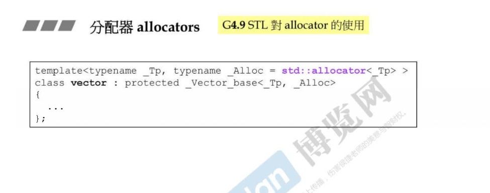
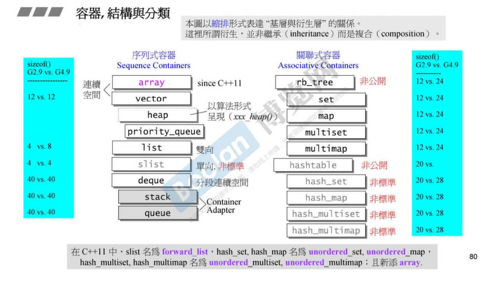
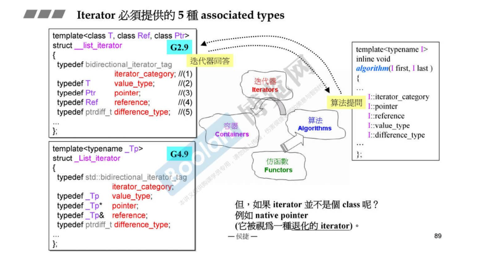

## STL 第二讲

### 操作符重载&模板

### 分配器

operator new

### 容器关系

### list探索

- 不能连续++++   所以对应的是self&

### Iterator

### vector

3个指针:

- start
- finish
- end_of_storage

### array

### forward_list

### deque

- node 控制中心
- first 
- next
- cur

### queue

### stack

### RB_tree 红黑树

### set

### map

### hashtable

- 针对碰撞

### hash

### unordered——set|map

