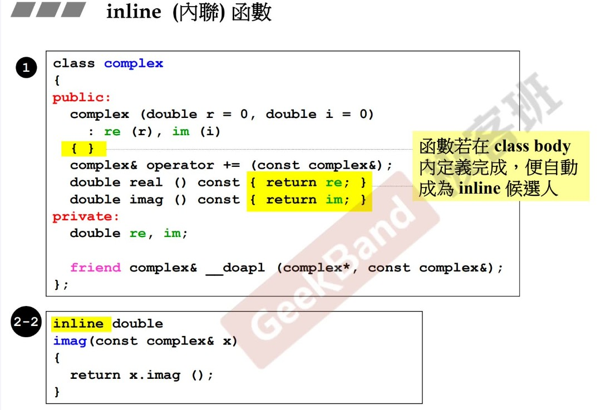

## C++面向对象 Part1

### 头文件和类的声明


### 内联函数



### 构造函数-初始列

尽量写初始列，可以显的高端


### 单例模式

构造函数放在私有区


### 常量const成员函数

类的成员变量数据不改变


### 参数传递（值value  引用const）

最好所有的参数传递传 **引用** 速度增加


### 返回值传递（值value  引用const）


### 友元

可以取得private 自由取得


**相同class 的各个对象互为友元**


### class 的定义规范

- 参数定义在private

- 参数、返回值尽可能reference传递
- 在类的本体函数应该加，则加const

#### 什么情况下不能返回reference

**local 变量不可以**

c1 + c2 加完后 应该放在哪个地方，如果放在local变量，函数结束，释放变量，所以不能传引用

`complex& __doapl(complex* ths, const complex& r)`


### 操作符重载 临时对象

所有成员参数，隐藏参数this


传递者无需知道接收者是以reference传递


#### 非成员函数 无this


#### 临时对象

**`typename ()`**

临时对象，绝不能return by reference


负号 返回临时对象


cout<< 重载 ，不能写成成员函数的写法 this

operator << (const) (std::ostream& os, const complex& x) 不能加const,ostream 不是固定的


#### 获得代码

complex.h

comple.cpp

#### 总结

```h
class complex {
public:
    // 列表初始化 加快运行速度
    complex(double r = 0, double i = 0): re(r), im(i) {}
    // 函数在class内定义为inline函数
    double real() const {return re;}
    // 常量成员函数 const修饰函数
    double imag() const {return im;}
private:
    // 成员变量都设置为private
    double re, im;
// 友元函数破坏了封装性 可以访问对象的私有成员 友元函数不属于成员函数 定义在类的外面
friend complex& __doapl(complex*, const complex&);
};
```

**设计类注意事项**

- 初始列 会用
- 函数应不应该加const
- 参数传递尽可能引用，该不该加const
- return 应该返回值还是reference
- 数据放在private,函数放在public

### 编程complex 


### 三大函数：拷贝构造、赋值、析构

 拷贝构造：String s3(s2);

拷贝赋值： s3 = s1;


- 传值
- 拷贝构造
- 拷贝赋值
- 析构

#### 构造 析构

动态分配内存后，有指针，需要析构


类含有指针成员，必须有**拷贝构造（深拷贝）、拷贝赋值**

##### 浅拷贝情况 :指针指向，会造成内存泄漏


##### 深拷贝情况


#### 拷贝赋值

- 清空内存
- 动态分配
- 拷贝


检测自我赋值（高手会写）如果自我赋值后相等，直接返回

一定要检测是否相等，否则，非造成指向为空


### 堆、栈、内存管理

Stack，是存在於某作用域(scope)的一塊內存空間(memory space)。例如當你調用函數，函數本身即會形成一個stack用來放置它所接收的參數，以及返回地址。在函數本體(function body)內聲明的任何變量，其所使用的內存塊都取自上述stack。

Heap，或謂system heap，是指由操作系統提供的一塊global內存空間，程序可動態分配(dynamicallocated)從某中獲得若干區塊(blocks)。

静态对象（stack object），其生命在作用域(scope)結束之際結束。這種作用域內的object，又稱為auto object，因為它會被「自動」清理

global object，其生命在整個程序結束之後才結束。你也可以把它視為一種static object，其作用域是「整個程序」

```cpp

class Complex { …
}

Complex c3(1,2)
int main()
{

```

**new 之后 一定要有 delete,否则会造成内存泄漏**

```cpp

class Complex {
}

{
    Complex* p = new Complex;

    delete p;
}
```

#### new 的过程

- 分配内存
- 转型
- 构造函数


#### delete 过程

- 析构函数（动态分配的删除）
- 释放内存（字符串本身内容）


#### 内存块内容

**complex (2*double)和string(4 bit)**

- 调试模式下 52 ，但保证16的倍数,加(pad),64
- 非调试模式下16

红色部分：两个cookies


**数组array在VC情况下** 

(8**3)+(32+4)+(4*2)+4 ==3个复数+（header 部分 32 + 4）+ （上下cookie2*4 ）+(记录整数 4)


**array new一定要搭配array delete——好习惯**

这样写：这样编译器才知道删除的是一个数组，而不是单一的值

**delete[] p**


### **扩展补充：类模板，函数模板**

**static:**

- class 内声明
- class 外定义


#### 类模板


#### 函数模板


#### namespace


### 组合与继承

#### 组合 has-a(含有)

我里面有另外一个 queue含有deque

利用deque的操作函数来完成操作

##### **Adapter: 改造适配**


##### 内存角度来看：

int 4bits

指针：4bit


##### 构造角度，析构角度

**由内而外：**Container的構造函數首先調用Component的default構造函數

**由外而内：**Container的析構函數首先執行自己，然後才調用Component的析構函數。


#### Delegation委托

指针相连


#### Inheritance 继承

不一定都是public,还可以有private,protected


**继承下的构造与析构关系：**

- 构造由内而外
- 析构由外而内


##### 继承虚函数

- non-virtual函数 不希望override
- virtual函数  已有定义  可以希望override
- pure virtual 纯函数 没有定义 必须override


#### 继承+复合

第一种顺序应该放如何，是先BasePart 还是Component part; **先base**

第二种顺序构造 compone->base>derived object


#### 委托+继承


## keys-points

- 构造函数初始列

- 常量成员const

- 参数传递   最好所有的参数传递传 **引用** 速度增加

- 返回值传递  complex& operator += (const complex)

- 友元

  - 自由取得private 成员
  - 相同class 的各个对象互为友元

- 参数定义规范

  - 参数定义在private
  - 参数、返回值尽可能reference传递
  - 在类的本体函数应该加，则加const

- 什么情况下不能返回reference

  - local变量
  - c1 + c2 加完后 应该放在哪个地方，如果放在local变量，函数结束，释放变量，所以不能传引用

  - `complex& __doapl(complex* ths, const complex& r)`

- 构造 析构
  - 动态分配内存后，有指针，需要析构
- 浅拷贝：指针指向，会造成内存泄漏
- 深拷贝：

- 检测自我赋值情况

- new 之后 一定要有 delete,否则会造成内存泄漏

- new 的过程
- delete 过程

- 内存块内容
- 组合
- 委托
- 继承
- 虚函数
  - non-virtual函数 不希望override
  - virtual函数  已有定义  可以希望override
  - pure virtual 纯函数 没有定义 必须override